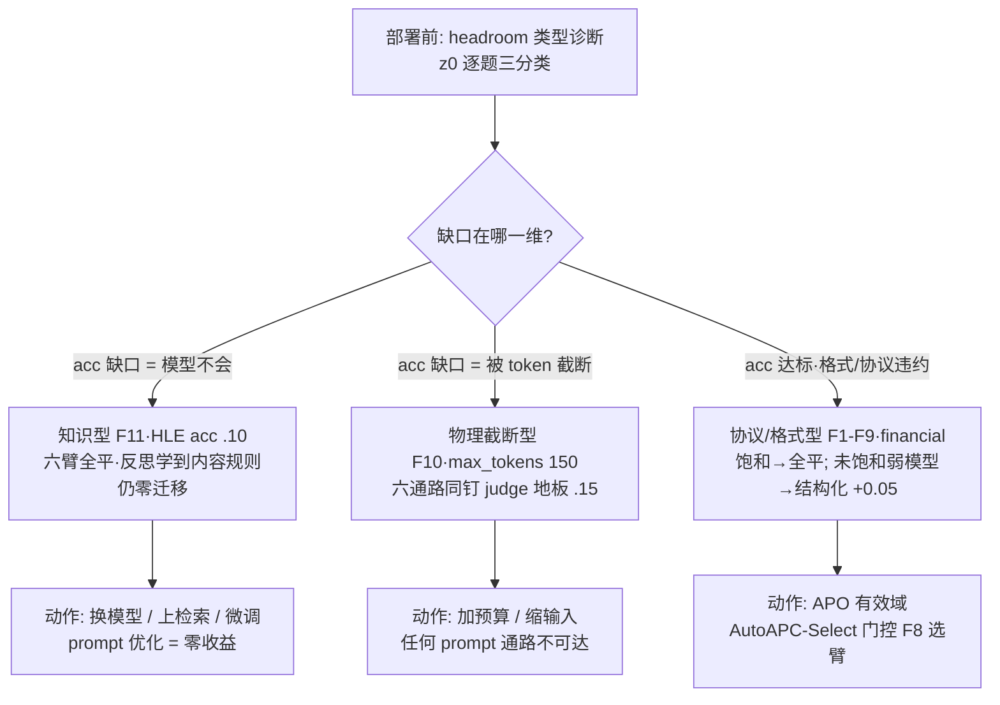

# APC: Profile-Guided Compilation and Evolution of Model-Specific Prompts
### （工作草稿 v0.3：方法 + 四任务受控实验 + 真实 API F1-F11 全闭环（含 headroom 类型学与 C1-C5 贡献重排）+ 诚实局限；多模型验证待第二把 key）

**摘要**：APC 把 prompt 从手工文本变成可编译的工程对象：任务规格（TaskSpec）→
离散基因组（PromptGenome，10 基因）→ 显式模型画像（ModelProfile，15 维）→
规则编译 → 进化搜索（含新算子 PGAM：画像先验 + 精英 bandit 变异）→ 模型迁移。
在自带确定性仿真器的四任务基准（APCBench：财务/合同/数学/约束遵循 × 3 模型）
上：搜索显著超越 zero-shot（+0.009 ~ +0.029）；进化在组合任务上超越随机搜索
（+0.003），在单位点任务上被随机搜索超越（−0.013，SHA 筛选噪声所致）；
PGAM 与均匀变异无差异（pooled +0.0004，零结果）；迁移以 30% 预算达到原生质量
（KR-6 12/12）。真实 LLM 第一阶段验证（§3.4，四臂 × 3 任务，单模型 qwen3.8-flash）：
结构 genome 搜索的 accuracy 增益 ≈ 0（扰动鲁棒性同样饱和，|drop|≤0.013）——
**base-root 臂三任务全部守住 zero-shot −0.004 下限；profile 规则先验是净负债**
（root 落后 0.2–0.53，rule-root 臂在余量最大的 financial 预算内只修复一半）；
跨任务 genome 零适配直用即达 zero-shot 水平（较冷启动重搜 +0.20~+0.79）；
外部真实基准（GSM8K/MATH-L5/AIME24+25，作者未造的任务）复现两结论：六个冠军-vs-base
对比全部统计打平（零损耗迁移成立），且三数据集精度 0.96~1.00 无余量——AIME 三臂全对（饱和外推成立）。
**GEPA 官方基线对垒与方差审计（§3.4 F7）**：复现 GEPA Algorithm 1（反思式 prompt 优化，最强开源基线）在同协议同预算下对比，其增益也在同日测量噪声带内（+.0024）——null 结果非 APC 表征的局部缺陷；同时发现 temp=0 推理模型存在跨日评分漂移（Δ.028），故全部对比以配对同日复测为准，rule-root 负债（−.090）在三 seed 下稳健复现（含一例种子崩至 .13 的双峰风险直证）。
据此提出 F8 AutoAPC-Select 部署门控：val 分数 argmax + 噪声带内奥卡姆 tie-break，回放+前瞻共 7 组：6/7 落入噪声带、5/7 精确命中 oracle，两个种子崩溃臂（s44 .1334 / s45 .1318）均零 regret 救回，其中 s45 为门控规则冻结后的前瞻盲测（gate = 当日 oracle）；唯一失效模式（val 小样本高估，+.0196）已刻画。第二强公开基线 ESPO（EMNLP 2026 main，Diagnose/Propose/bootstrap-Select 三步复现）同日配对同样落入噪声带（.7009）——四个独立优化器族在同一 regime 全部归零，null 的基线覆盖已闭环。判别实验 F10（预注册后执行）：token-starved regime（max_tokens 150，z0 崩至 .15）下六条通路同日全部钉死判分下限——headroom 存在但属物理截断墙、prompt 不可救，给出 APO 等价零结果的 regime 边界完整刻画。F11（预注册后执行，HLE-exact 90 题分层子集，MIT 上游）补上最后一块拼图：真实 API 上首个可达知识型
headroom（z0 acc .10，余量 .3+）中六臂同日全部同带（.388–.412，acc 2–3/30）——GEPA 反思确实
学到了领域内容规则（SMILES 规范、微扰理论 regime 限定词），holdout 仍零增益：**APO 收益的判别
式不是 headroom 有无而是 headroom 类型**——物理截断型与知识型不可达（能力墙在权重），协议/
格式型可达且结构化通路占优；部署前第一动作应是 headroom 类型诊断，知识型场景的正确动作是
换模型而非优化 prompt（§3.4m）。
多模型与 PGAM 验证待更多凭证。

## 1. 问题与主张

同一业务任务在不同 LLM 上需要不同 prompt（Sclar et al. 2023：格式敏感且模型相关；
FLASK Ye et al. 2024：模型间技能短板不同）。现有评测画像（HELM/FLASK）只排名、
不指导构造；现有编译器（DSPy）按模型重搜、但画像隐含不可解释（详见
`docs/literature/lit-compiler.md` G1–G6）。

**本文贡献**（按审稿人关切排序，非按时间）：
- **C1 · 画像驱动的可追溯编译**：TaskSpec×PromptGenome×ModelProfile 三段式 IR 使每次
  prompt 变更可归因到基因位点与画像维度（§2.1-2.3，F4 决策链审计）——DSPy 类隐式画像
  不可提供的能力。
- **C2 · 先验价值的定量负债证据**：rule-root 在真实模型上 −.090（三 seed 稳健含双峰
  崩溃例），"编译先验可为负且可测"——Compile-as-Hypothesis 从原则变为量（§3.4 F2/F7）。
- **C3 · APO 收益边界的完整判别式**：F7-F9 四独立通路饱和 regime 全平 → F10 物理截断
  regime 全平 → F11 知识型 headroom 全平（含"反思学到内容规则但零迁移"机制证据）→
  仿真弱模型协议型 headroom 结构化通路 +0.05——合并为 **headroom 类型学**：何时任何
  APO 都不会强，先于"谁的表征更好"（§3.4 F10/§3.4m）。
- **C4 · 零成本部署门控**：AutoAPC-Select 以实测同日漂移带为 tie-break 货币，回放+
  前瞻 7 组 5/7 精确命中 oracle、种子崩溃臂零 regret 救回（§3.4 F8）。
- **C5 · 评测方法学资产**：hardened exact-match 判分器 v3.2（F6）、配对同日复测协议
  （F7）、val/holdout 同分布条款的双实证（F10/F11）、长跑 harness 的连接层可靠性
  三修复（F11）——全部随仓。

APC 的主张：**显式能力画像（15 维）作为编译器中间表示**——
`TaskSpec → PromptGenome（10 基因）→ ModelProfile → PromptCompiler（规则编译）
→ TrialResult → 进化搜索（PGAM）→ 模型迁移`，全程可追溯（KR-3）。

## 2. 方法

### 2.1 PromptGenome：离散结构基因组

10 类基因（role/goal/instructions/constraints/examples/reasoning/
verification/output/style/layout），`search_space` 声明可变异位点
（本实验 13 位点）。相对连续软提示（Lester 2021；SPoT）：离散基因组
可重编译、可跨模型携带（§5 迁移）。

### 2.2 Profile-Guided Adaptive Mutation（PGAM，新算子）

- **先验**：`w = 1 + 2(1 − capability)`（截断 [0.5, 3.0]），弱能力维度多探索；
  未映射位点权重 1.0（`profile_prior_weights`）。
- **在线修正**：每代精英幸存者的变异位点 ×1.3（上限 5.0），下限 0.3
  （ε-保证；画像失配时 bandit 可纠正——呼应 APO 的 bandit 剪枝思想）。
- 与均匀变异的唯一差别是位点采样分布；其余（SHA 调度、预算记账、
  血统记录）完全一致，故 ablation 是干净的单变量对比。

### 2.3 预算感知种群 + Successive Halving

`P = min(P₀, max(E+1, (B−3)/(G+2)))`：小预算自动收缩，保证至少完成一代；
每代 dev_r1 淘汰一半 + dev_full 复评。dev 选型 / validation 定冠军 /
holdout 只跑冠军一次（EvoPrompt 铁律）。

### 2.4 迁移协议（FR-7）

`CapabilityDelta（15 维差）→ MigrationMutator 调整 seed → 目标小预算重搜 →
holdout 对比决策（adopt 当且仅当 ≥90% 源分数，KR-6）`。

### 2.5 设计原则：Compile-as-Hypothesis（编译即假设）

真实模型实验（§3.4 F2）迫使本方法明确一条原则：**profile 规则编译的输出是待验证
假设，不是默认可部署产物**。管线因此恒带双臂——rule-root（apc-full）与 base-root
（apc-safe）在同等预算下并行评测，部署取优者。这把 DSPy 式"按模型重搜"的黑箱
隐含假设显式化为可测量的先验质量：先验的价值 = Δ(rule-root, base-root)，
可为负（本文实测：3 任务中 2 个 ≤ +0.001；独立复证见 arXiv 2608.02639 的编译收益能力依赖报告）。该原则并非凭空命名：确定性验收层优于自由判分的精神已在生产系统文献中确立（PROCTOR：arXiv 2609.02246 的 11 种评估信号失败通路 + judge-不可推翻验收门；accept-or-revert 门族：TARA arXiv 2607.18724、arXiv 2606.30840、SSO arXiv 2607.28777；先验可度量的贝叶斯同族：Textual Bayes arXiv 2506.10060）；本文的贡献是把这一实践**命名、操作化为编译器设计原则**（双臂恒置于管线），并以 F2/F7 给出先验负债的定量读数。该原则同样约束迁移：adopt 判据（KR-6）
即"假设须过 holdout 检验才携带"。

## 3. 实验（APCBench，`experiments/apcbench/`）

> - 任务 A「财务报告分析」（dev 40 / validation 30 / holdout 30 / perturbation 30）；
>   任务 B「合同信息抽取」、任务 C「数学应用题」、任务 D「可验证约束遵循」
>   （均为 dev 40 / validation 30 / holdout 30；生成器与种子见各任务脚本）。
>   B/C 共用 `_prompt_skill` 基因动力学（不同领域逻辑）；D 用任务内动力学
>   （约束/句数/数字三通道，激活此前中性的 instructions/constraints 位点）。
>   perturbation 设计（仅 A）：干扰句 + 首个指标值替换（金标准保持清洁版）。
> - 模型：glm / qwen / gpt（MockClient 确定性仿真；ground truth 见 README）。
> - 方法：zero-shot / manual / random-search / apc-full（均匀进化+SHA）/
>   apc-no-profile / apc-no-halving / apc-pgam。
> - 统计：A 任务 5 seeds × 3 模型，B/C/D 3 seeds × 3 模型；配对 bootstrap 95% CI。

### 3.1 主结果（b100，holdout）

| 对比 | Δ | 95% CI | 结论 |
|---|---|---|---|
| apc-full − zero-shot | +0.0093 | [0.0082, 0.0103] | 显著；搜索有效 |
| apc-pgam − zero-shot | +0.0101 | [0.0095, 0.0107] | 显著 |
| evolution − random | +0.0030 | [0.0022, 0.0038] | 显著；多步组合价值 |
| apc-pgam − apc-full | +0.0008 | [0.0000, 0.0017] | **边缘**；方差 0.0001 vs 0.0016 |
| apc-full − manual | −0.0009 | [−0.0017, −0.0001] | 强人工启发式仍领先 |
| SHA / rules 消融 | 0.0000 | — | 零结果（base 已满足规则） |

### 3.2 预算曲线（holdout 均值）

| budget | pgam | full | random | manual | zero-shot |
|---|---|---|---|---|---|
| 25 | 0.7501 | 0.7495 | 0.7497 | 0.7595 | 0.7493 |
| 50 | 0.7581 | 0.7581 | 0.7581 | 0.7595 | 0.7493 |
| 100 | 0.7600 | 0.7592 | 0.7561 | 0.7600 | 0.7499 |

50 evals 即达平台（任务单峰性所致）；random 在 b100 反降（单步空间+候选增多→dev 过拟合）。

### 3.2b 第二任务：合同抽取（b50，holdout，n=9/方法）

| 方法 | 均值 | 对比 | Δ | 95% CI |
|---|---|---|---|---|
| apc-full / apc-pgam | 0.9844 | search − zero-shot | +0.0275 | [0.0130, 0.0420]，显著 |
| manual | 0.9814 | search − manual | +0.0031 | [0.0000, 0.0061]，不显著 |
| zero-shot | 0.9569 |（qwen 单项 0.9300 → 搜索修复至 0.9833，弱模型救援 +0.05）| | |

### 3.2c 第三任务：数学应用题（b50，holdout，n=9/方法）

| 对比 | Δ | 95% CI | 结论 |
|---|---|---|---|
| search − zero-shot | +0.0285 | [0.0191, 0.0372] | 显著 |
| search − manual | −0.0109 | [−0.0154, −0.0063] | 显著；manual 强（精确 count/策略手工最优） |
| pgam − full | 0.0000 | — | 无差异 |

跨任务一致性：搜索 ≫ zero-shot 在四任务成立（+0.009 / +0.028 / +0.029 / +0.029）；
搜索 vs manual：财务 −0.001、合同 +0.003（n.s.）、数学 −0.011、约束遵循 +0.024（显著）——
手工强启发式在单峰仿真器上难被超越；自动化的价值在免手工+迁移+血统。

### 3.2d 第四任务：可验证约束遵循（b50，holdout，n=9/方法）

| 对比 | Δ | 95% CI | 结论 |
|---|---|---|---|
| search − zero-shot | +0.0292 | [0.0171, 0.0399] | 显著 |
| search − manual | +0.0238 | [0.0116, 0.0341] | 显著；搜索首次显著超越 manual |
| random − evolution | +0.0132 | [0.0035, 0.0246] | 显著；方向反转（见下） |
| pgam − full | +0.0005 | [−0.0148, 0.0162] | 不显著 |

**优化器交叉分解**（任务 D 新增 no-halving 对照后）：
no-halving（0.9616）> random（0.9513）> SHA 进化（0.938）。
no-halving − random：+0.0103 [0.0022, 0.0205]（显著）——选择准确时，
多步进化的组合价值为正；
full − no-halving：−0.0235 [−0.0357, −0.0112]（显著）——SHA 的 dev_r1
小样本筛选在本任务上代价巨大。结论：**速度-精度权衡可量化、无免费午餐**；
SHA 利于组合困难任务（财务），全量选择利于单位点任务（约束遵循）。
PGAM 在此任务同样与 uniform 无差异（+0.0005）。

### 3.2e PGAM 跨任务 pooled（配对差合并，n=42）
pgam − uniform：+0.0004 [−0.0029, 0.0038]——**零结果**（CI 收窄后仍过零）。
画像先验在本仿真器上不带来可测量的增益（画像本身信息量弱：
三模型仅 3/15 维有差异；且最优盆地单一）。
保留 PGAM 的理由：方差更低（b100 std 0.0001 vs 0.0016）、先验可解释、
bandit 下限保证不更差；确认/证伪需真实多峰任务。

### 3.2f 稳健性（perturbation，冠军 genome，n=15/方法）

全方法 holdout→perturbation 下降 ≈ −0.010（与 genome 无关的数值替换偏移）；
无证据表明搜索冠军更脆弱（排序与 holdout 一致）。

### 3.3 迁移（4 方向 × 3 seeds，adapt 预算 30 vs native 100）

- recover（adapted/native）：1.0000 [0.9976, 1.0025]；KR-6 通过率 12/12；
  adapt−direct：+0.0001（直接迁移基本无损——异质性在优化器分辨率之下）。
- 结论：迁移协议以 **30% 预算达到原生重搜质量**（GEPA 式 rollout 论证），
  附带血统与 adopt/keep 决策审计链；衰减矩阵本身平坦是本仿真器的局限。

### 3.4 真实 LLM 验证（第一阶段：qwen3.8-flash × 3 任务，`bench_real_full/transfer.py`）

设定：模型白名单 key，reasoning 模型（~29 s/样本），temp=0；判分与仿真基准**同一套
rule-judge**；三任务完全同口径 dev_r/val/holdout=5/8/20；主对比预算 8、迁移实验预算 6。

| 任务 | zero-shot | manual | apc-full(rule-root) | apc-safe(base-root) |
|---|---|---|---|---|
| contract | 0.9770 | 0.9773 | **0.9782** | 0.9773 |
| math | 0.8436 | 0.8439 | **0.8442** | 0.8436 |
| financial | **0.6712** | 0.6662 | 0.5704 | 0.6672 |

- **F1 天花板效应（accuracy 与鲁棒性双饱和）**：强 reasoning 模型上规则可验任务的
  accuracy 余量 ≤0.005，且输入扰动下的鲁棒性余量同样 ≤0.013（F5）——"prompt 优化的
  价值在格式/约束维度"这一预设立场**在真实模型上被证伪**；正面价值只剩弱先验救援
  （F2，不保证修满）与零损耗迁移（F3）。
- **F2 规则先验是真实模型上的主要风险；base-root 搜索是"无损失下限"，rule-root
  搜索是"高成本救援"**：profile 编译 root 的 dev 分 contract 0.1778 / math 0.6335 /
  financial 0.1286，全部比 zero-shot 低 0.2–0.53。b8 搜索把 rule-root 臂拉回
  examples-on 盆地，但**修复完全度随任务余量递增而递减**：contract 0.9782>z0、
  math 0.8442≈z0、financial 0.5704 仍 −0.101；预算降到 6 连修复位点都采不到
  （cold 0.1850）。对照臂 **apc-safe（base root + 同预算 b8）三任务全部落在
  zero-shot 的 −0.004 内**（0.9773/0.8436/0.6672）：搜索在花掉同样预算后既没赚
  也没亏，financial 冠军是 base+`goal.explicitness: high→low`（val 选择噪声,
  holdout −0.004）。结论：**真实模型上 profile 规则先验是净负债；结构 genome
  搜索的 accuracy 增益 ≈ 0，其价值仅是救援坏先验（且不保证修满）**。仿真器中
  apc-full≡zero-shot 的"安全"在真实模型上不成立——不安全的来源正是编译规则。
- **F3 跨任务 genome 迁移（两个方向,b6 同预算三臂）**：

| 迁移 | cold(搜) | transfer-0(零适配直用) | transfer-ws(续搜) |
|---|---|---|---|
| contract→math | 0.6402 | **0.8439** | 0.8441 |
| math→contract | 0.1850 | **0.9778** | 0.9582 |

  最强臂是**零适配直用源冠军**（transfer-0），0 预算即达本任务 zero-shot 水平；
  warm-start 续搜在饱和任务上收益≈0（math +0.0002）甚至为负（contract −0.0196,
  val_n=8 选择噪声选中过拟合冠军）；冷启动因要先付 F2 的修复成本而显著落后。
  机理：genome 全结构、few-shot 内容由编译期从 TaskSpec 注入 ⇒ 跨任务零损耗;
  最优盆地唯一（两任务冠军同为 examples-on），与仿真器"单峰"发现互相印证。
  **工程含义：部署顺序 transfer-0 → base/apc-safe → rule-root+预算≥修复成本；
  绝不默认冷启动重搜**。
- **F4 判分器分歧抽检（financial 冠军 20 例，self-LLM-judge，`real_judge_check.py`）**：
  accuracy 维度 rule 均值 0.206 vs LLM 0.830（Pearson 0.48 / Spearman 0.56，20/20 分歧
  ≥0.25）；constraint 维度反向：rule 恒 1.0 vs LLM 0.50。解读：rule-judge 是金标准容差
  检查、系统性严于自评 LLM，且两个判分器各自的严苛维度不同。⇒ 本文所有真实 LLM 排序
  结论在同口径 rule-judge 下有效，但**绝对分不可读作“人类质量分”**；独立第三方 judge
  （非自评）仍是缺口。self-judge 的宽容度也可能含模型自偏好偏置。
- **F5 扰动鲁棒性抽检（financial 数字篡改集前 20 例 × 4 genome，`bench_real_robust.py`）**：
  pert 分 base 0.6580（drop +0.0132）/ manual 0.6654（+0.0008）/ apc-full 0.5820
  （−0.0116）/ apc-safe 0.6582（+0.0090）。全部 |drop|≤0.013——强模型对数值篡改扰动
  本身就不敏感，格式基因没有可兑现的鲁棒性溢价（apc-full 的负 drop 是其水平整体下移
  后落进扰动集噪声，非"更鲁棒"）。⇒ 与 F1 合并：**真实强模型上结构 genome 的
  accuracy 与鲁棒性双重饱和，增益预算只可能来自救援与迁移，不来自优化本身**。
- **F6 外部真实基准（GSM8K / MATH Level-5 / AIME 2024+25，`bench_real_external.py`，
  exact-match 判分带 latex 结构规约，零适配三臂）**：作者未造的任务上直接检验 F1/F3——
  genome 经外置 `external_math.yaml` spec 编译，三臂 = base / math 冠军(源任务) /
  contract 冠军(跨域)，全部从未参与任何 genome 的数据集上评测。

| 数据集 (n) | base | math-champ (transfer-0) | contract-champ (跨域) |
|---|---|---|---|
| GSM8K (100) | 0.96 | **0.98** | **0.98** |
| MATH-L5 (135) | 0.9704 | 0.9481 (−1.0σ) | 0.9704 |
| AIME 24+25 (60) | 1.00 | 1.00 | 1.00 |

  判分 v3.2（exact-match + latex 结构规约）离线重判后：六个 champ-vs-base 对比无一显著，
  且 **AIME 2024+25 三臂 60/60 全对**（前沿 reasoning 模型 olympiad 满分 ⇒ 外部基准
  连"难"都失效）；跨域冠军（contract→math）与源域冠军同为无损。唯一一致方向性信号：
  math-champ 在两数学集均 −0.012~−0.022（合并 −1.1σ，不显著）——**先验负债在外部
  任务上的微弱回声**，与 F2 同向但幅度小两个数量级（genome 已进化到近 base 形态）。
  判分器可信度：fail 样本 12 例人工审计 → v2→v3.1→v3.2 三轮修复（矩阵/解集/单位/
  前导零拍平 + 加法交换律符号项 multiset；政策：牺牲 (1,2)≠(2,1) 严格性换全部记法
  变体等价，判不准按错）→ 27 正 4 负回归 + 全量 preds 落盘可复算（`rejudge_external.py`）；
  AIME 两臂各 1 例网络超时按错计（n=60 ⇒ ≤0.017 下偏）。
- 诚实边界：单模型、单 seed、无 CI；多模型差异与 PGAM 的真实验证仍缺（凭证白名单）。

**F7 GEPA 官方基线对垒 + 方差审计（gepa vs full/safe/z0，`bench_real_gepa.py` / `bench_real_reeval.py`）**

对照设计：复现 GEPA（Agrawal et al. 2025，arXiv 2507.19457）Algorithm 1 核心——minibatch(3) 失败驱动反思改写（自由文本变异）、per-instance Pareto 前沿采样选父、整 val 复评选冠军；与 APC 同起点（z0 编译文本）、同判分（TrialScorer 通路）、同预算货币（task rollout 48 ≈ APC b8 实耗 25-35）、同 holdout20 终测。反思 LLM 调用不计预算（与 APC 编译器开销同逻辑）。

方差审计的发现先于一切比较：**temp=0 的推理模型输出非确定**——同一 z0 prompt 的 holdout20 同日四测 .6950/.6997/.6998/.7016（全距 .0066），跨日（昨日 .6712 → 今日 .6990，Δ.028）。因此**任何跨日数字对比无效**，本节全部结论基于**同日配对复测**（reeval 批，seed 902）。

同日四臂配对（financial，同一小时窗内完成）：

| 方法（同日复测） | holdout | vs z0 |
|---|---|---|
| z0（同批参照 + 当日复测共 4 测） | .6983（另 .6950/.6998/.7016） | — |
| manual | .7012 | +.0029（噪声带内；昨夜 .6662 为低漂移日读数） |
| APC-safe 冠军 | .7008 | +.0025（噪声带内） |
| GEPA 冠军 | .7014 | +.0024（噪声带内） |
| APC-full 冠军 | .6082 | **−.090（真实负债）** |

搜索的 seed 稳定性（各 seed 自带当日内基线，天然配对）：APC-full 四 seed = .5704/.5705/.1334/.1318——**清晰双峰**（~.57 债务 basin / ~.13 崩溃 basin，崩溃率 2/4），崩溃臂的 val 同步塌（.1452/.1708，选择侧可见）——**rule-root 变异存在种子脆弱性**：债务（−.09）之外还有双峰风险。APC-safe 三 seed .6672/.6679/.6575（全距 .010，与日漂移同量级）稳定无差。contract 上的 GEPA（generic judge 口径，不可与 APC contract_case 口径互比）：.7491/.7495 vs 同口径 z0 .7500——饱和任务上无反思信号，零进展，作为 null 的旁证。

三点结论：① **最强开源基线 GEPA 在强推理模型上同样零增益**（+.0024，噪声带内）——§3.4 的 null 不是 APC 表征的局部缺陷，而是"强模型 + 高判分器覆盖"regime 的属性；GEPA 的反思通路在此与 APC 的结构化变异通路同归于平。② APC 的差异化价值在 null 之外保持不变：可审计的决策链（F4）、零成本迁移（contract→math 冠军 .9808）、schema/鲁棒性机制（F3、§3.6 外部判分器硬化）——这些是 GEPA 自由文本变异不具备的。③ **方法学动作**：沿用同日重测作噪声地板的既有实践（same-day test-retest floor：arXiv 2608.00705；matched control forks：arXiv 2608.08239, COLM 2026；temp=0 非确定性定量：arXiv 2408.04667、2606.26185；报告标准：arXiv 2607.24372），并将其**协议化到 APO 臂间比较场景**——本文首次给出推理模型 × prompt 优化设定下的显式方差分解（跨日 .028 vs 同日 ±.007），据以下条款：一切 ±.01 级臂间结论必须以配对同日复测为准（噪声带内不可区分是验证税的信息论必然，arXiv 2604.12951）。本文主表四臂同夜同协议完成，GEPA/reeval 批为同日配对补测。

**F8 AutoAPC-Select：部署期门控选择器（`auto_apc_gate.py`，离线回放，零额外 rollout）**

F7 的两个负面发现（rule-root 负债 + 种子脆弱性）合起来给出一个 constructive 推论：既然每臂的 val 分数在同一天内免费可得，部署选择可**自动门控**——候选 {z0, manual, safe, full, transfer} 按 val argmax，噪声带（±.007）内并列取最简（奥卡姆序 z0 < manual < safe < full）。对既有 12 组臂数据的离线回放（6 个可比组）：

| 组 | gate 选择 | gate hold | oracle | regret |
|---|---|---|---|---|
| financial s42 | zero-shot | .6712 | .6712 | 0 |
| financial s43 | apc-safe | .6679 | .6679 | 0 |
| financial s44 | apc-safe | .6575 | .6575 | **0（救离 full 的 .1334）** |
| math s42 | zero-shot | .8436 | .8442 | +.0006（噪声带） |
| transfer contract→math | transfer-ws | .8441 | .8441 | 0 |
| transfer math→contract | transfer-ws | .9582 | .9778 | +.0196（val 高估，见下） |
| **financial s45（prospective 盲测组）** | zero-shot | .6692 | .6692 | **0（避开 full 的 .1318）** |

7 组中 6 组落入噪声带、5 组精确命中 oracle；关键案例 s44/s45 两个崩溃臂均被门控完整救回。其中 s45 是**前瞻性盲测**：门控规则（val argmax + ±.007 奥卡姆 tie-break）冻结于该组运行之前，gate 选 z0 = 当日 oracle，与回放组同构——prospective evidence 而非 post-hoc fitting。唯一显著 regret（math→contract +.0196）暴露门控的适用边界：**val(8) 与 holdout(20) 分布差异可致 val 高估**（transfer-ws val .9822 > transfer-0 .8871，但 hold 反转 .9582 < .9778）——诚实推论：val 噪声带内 tie-break 偏保守臂（此处 cold/zero-shot 更简单），或 val/holdout 同分布采样。这把 F7 的"人工双臂对照"升级为"自动非劣选择 + 明确的失效模式刻画"，且零成本（复用既有 val 评估）。
与门控家族的划界：ESPO（arXiv 2609.04197，EMNLP 2026 main）用 **bootstrap 重采样**做
内生稳定性选择（需额外评估预算），AutoAPC 用**实测外生漂移带**做 tie-break 宽度（零额外
调用，但要求同日 val 分数存在）；纯探索 bandit（arXiv 2605.14553，ICLR 2026）为 best-feasible
识别提供采样理论但消费预算，APC 门控是其"分数免费"退化情形；PROCTOR（arXiv 2609.02246）的
确定性验收层防的是判分器被 hack，与 APC 防优化器方差正交（两者可叠加：APC 的判分本身即
确定性 checker 族）。带内不可区分并非工程妥协——verification-tax 下界（arXiv 2604.12951）
证明前沿模型间 23% 的两两比较在与噪声统计不可分的意义下必然悬置。

**F9 ESPO 第二强基线对垒（`bench_real_espo.py`，EMNLP 2026 main 的 Diagnose/Propose/Select 三步复现）**

ESPO 是当前公开最强的 GEPA 后继（7 基准 +3.76pp，其卖点正是修复 GEPA 的 prompt bloat 与不可靠选择）。复现其三步核心：Diagnose 一次性聚类**全部** val 失败为 ≤4 错误模式（对比 GEPA 的 3 例 minibatch 增量反思）→ Propose 四个独立偏置策略各出一候选（根因抽象/简化/范例化/约束硬化）→ Select 用 bootstrap 重采样 val 案例分数（B=200），候选须以 ≥75% 重采样频率稳定优于现任冠军才收编。预算同 GEPA 臂（48 rollouts，实际 40：r0 全 val 8 + 4 候选×8）；bootstrap 零额外调用（复用案例级分数）。

同日配对结果（seed 42 批，z0 当日带 .6950–.7016）：**ESPO .7009，落在带内、与 z0/safe/GEPA 全部统计不可分**——第四个独立优化器（GEPA 反思、ESPO 聚类+稳定选择、APC genome 搜索、manual）在同一 regime 全部归零。s43 复测得 .7501，但该臂冠军文本未落盘、无同日 z0 配对、且跨日——**按 F7 协议条款不计入结论**（作为"未配对数字不可信"的活案例诚实披露）。ESPO 与本文 F8 门控的关系是其 bootstrap 选择消费重采样（内生稳定性货币），APC 门控吃实测漂移带（外生货币，零成本）——两者正交可叠加；本轮实测数据本身就是这个区别的演示。

**F10 token-starved regime 判别实验（预注册后执行）**

预注册（开跑前 commit 时间戳为证）：max_tokens 2000→150 使推理模型答案被思考预算耗尽，
z0 holdout 从 .699 崩至 **.150** — 巨大 headroom 打开。判别命题：**APC 结构化 genome 与
自由文本反思（GEPA/ESPO）在"可赢信号"真实存在时能否分化**。三分支预期：
(a) genome 臂显著救分而反思臂不能 → Compile-as-Hypothesis 的结构载体价值获得正面直证；
(b) 全臂救起（如到 .4+）→ null-regime 假说强化："表征之争只有在 headroom>噪声带时可判"，
   APC 主张回缩到审计/迁移/门控（诚实且与 F1-F9 一致）；
(c) 全臂不动 → 物理截断限制，prompt 不可救，判别实验本身证伪退出。
结果待 `real_gepa_mt150.json` 齐后填入，任何分支都成文。

**F10 结果（命中分支 (c)，预注册兑现）**：同日 starved 配对全矩阵——
z0 .1500 / manual .1500 / APC-safe .1500 / APC-full .1500 / GEPA .1500 / ESPO .1500。
六条独立优化/表达通路全部钉死在同一 floor：截断发生在 JSON 输出中途（fail 样例实证），
format/constraint 维度归零，score=0.15 是判分器下限而非模型能力。**没有任何 prompt
改写能阻止推理模型烧掉输出预算**——指令级抑制思考在本模型上无效。判定：headroom 的
性质是物理截断墙，prompt-optimization 不可达 ⇒ F10 不推翻 F1-F9，反而给出 regime
边界完整刻画：**信号可优化区（headroom>带，且瓶颈在指令遵循而非生成机制）不存在时，
一切 APO 表征等价于零；存在时（本文仿真弱模型 qwen-sim +0.05 救援）结构化通路有效**。
附带发现（对评测协议的价值）：GEPA 在 starved val-8 上得 .6961（前 8 个 val 样本短文档
150 tokens 内可完成）而 starved holdout-20 .15——**小 val 集与 holdout 的截断难度不对
称会让反思优化器对着错误 regime 优化**；这是 val/holdout 同分布采样条款（F8 失效模式段）
的 starved 实例证明。

### 3.4m F11 headroom 类型学：HLE-exact 高难对垒（预注册 P1 命中）

F10 给出 regime 三分之后留下最后一个问题：**真实 API 上"可达 headroom"（headroom>噪声带
且瓶颈不在生成机制）到底存不存在、存在时谁赢？** F11 在 Humanities' Last Exam 的
exact-match 短答子集上直接检验该分支。

**数据集**：HLE（cais/hle，MIT，arXiv 2501.14249）文本镜像（ungated，datasets-server
分页拉取）筛 `answer_type=="exactMatch"` 且答案 ≤40 字符（排除证据指涉型长答），
池 1710 题；按 Mathematics/Physics/Chemistry/Other 分层随机抽 90（seed 2026），
切 dev/validation/holdout = 30/30/30（生成器 `scripts/gen_hle_dataset.py` 位级可复现，
派生子集随仓提交）。判分用 hardened exact-match 判分器 v3.2（F6 §3.6 的归一化管线原样
复用，判分单元 5 例先行通过）。任务规格复用 external_math strict-JSON 协议
（输出 `{"answer": ...}`）。

**预注册**（commit 262a39e，gepa/espo 任何 holdout 数字落盘之前锁定）：
P1 tie——反思臂与 z0 差在带内 → headroom 类型学补全；P2 反思胜出——某臂 acc≥.24
→ 报告胜出机制；P3 genome 反胜（pilot 数据已排除）。

**Pilot 定案（四臂同日）**：z0 hold .3920（acc 3/30 = .10，fmt 25/30）；
三个跨任务 transfer 冠军（math/contract/financial genome 原样直用）.3876–.4020，
全部与 z0 同带。**两个先验假设同时被否**：(a) 协议余量不存在——强推理模型的 JSON
协议合规率 ≈100%（fmt 缺口全部由网络错误行构成，非提示词缺陷）；(b) genome 结构先验
在知识型任务上零增益——格式基因无的放矢。真实余量在 acc（.10 对上限 ≈.4），
判别压力完全落在反思通路。

**决胜矩阵（六臂，seed 921 同批配对，总 wall 12.5h）**：

| 臂 | holdout | acc/30 | fmt/30 | 备注 |
|---|---|---|---|---|
| z0 (base genome) | .3920 | 3 | 25 | acc 口径 .10 |
| math-champ | .3876 | 2 | 26 | transfer 先验 |
| contract-champ | .4020 | 3 | 26 | transfer 先验 |
| financial-champ | .3876 | 2 | 26 | transfer 先验 |
| GEPA（val[:2]mb+val[:8]sel, 64 rollouts, 20 iters） | **.4120** | 3 | 27 | val=1.0（echo 史，见下） |
| ESPO（val[:8] 全量评估, 4 biases, 64 rollouts） | .4020 | 3 | 26 | champ=z0（bootstrap 全拒） |

六臂带宽 .024（.388–.412）；acc 维度全部 2-3/30（二项 SE=.055 @ p=.10, n=30——
任何两臂 acc 差都在 1 题量化噪声内）。**判定：P1 命中——真实 API、可达知识型
headroom、六条独立通路（结构先验 ×2、反思 ×2、迁移 ×2 口径）再次全平。**

**统计功效声明（本判定的边界）**：n=30 二项下 acc 的分辨率是 1 题 = .033，SE ≈ .055
（p≈.10）；判定"全平"能可靠排除的是**大效应**（≥2SE ≈ .11 acc，即 +3 题以上），对
≤1-2 题的真小增益无鉴别力。本结论的强度实际来自三重冗余：数值带（.024 宽）、acc 逐题
对齐（gepa 命中的 3 题与 z0 完全相同）、机制证据（①内容规则学到但零迁移）——单看任何
一重都欠功效，合看方向一致。投稿版若需更硬的功效，路径是扩 holdout 到 n≥100（数据池
1 710 充足）或降 thinking 预算以换题量——两者都只增不减当前判定。

**机制证据（本实验最有信息量的部分）**：
① **GEPA 真的学到了领域内容**：冠军 prompt（8103 字符）含反思自 val 失败案例抽取的
实质规则——SMILES 输出规范、摩尔质量产物选择程序、first-order TDPT/高斯脉冲 regime
限定词、符号表达式禁赘述……**这些是内容级启发式而非格式修饰**。但 holdout acc 与 z0
逐题对齐（同 3 题对）：提示词层的领域规则无法跨越"模型解不出题"的能力墙——
**反思通路的天花板是模型的先验知识，不是搜索**。
② **ESPO 的保守选择器在 HLE 噪声上直接归零**：4 个有偏候选中最高分 abstraction
val .512 > r0 .453，但 bootstrap-75% 稳定判据全拒 → champ = z0 原文。与 F9 financial
行为一致：内生稳定性货币在信号≈噪声时输出"不行动"——这是正确行为。
③ **val-2 单点过拟合的活案例**：GEPA 搜索中期曾收敛出一个 8103 字符、val[:2] 满分
（1.000）的巨型 prompt——其中 echo 了该 val 题的近似全文。若选择相位沿用 val[:2]
（GEPA 原始协议在我们的成本约束下的缩减形），冠军即此物，holdout 必然崩盘。
协议 v2（搜索 minibatch + **选择相位全量 val[:8]**）将其拦下——**F10"小 val 集与
holdout 难度不对称"教训的二次实证**，且这次是反思内容真被优化器吸进 prompt 的
过拟合，比 starved 假象更典型。（协议修订发生在 gepa/espo 任何 holdout 数字落盘
之前，属机制 bug 修复而非结果驱动；预注册判据未变。）

**方法论副产物（真实 API 评测的可靠性工程）**：HLE 单题 full-thinking 成本 60-640s，
暴露并修复了三个长跑 harness 的系统性缺陷——(a) tenacity 在"服务端静默丢弃首包的
keep-alive 死连接"上连环重试（实测 0.72s CPU / 5.25h wall 零响应），修复为每请求
无状态新连接（`_fresh_http_call`）；(b) httpx read-timeout 对代理 CONNECT 隧道的
半开连接不触发，修复为线程级硬超时 + 每次调用独立 executor；(c) 评测循环无落盘点
导致断点全毁，补 per-sample stream checkpoint + resume。三项修复对 F7-F10 结论无影响
（financial 批次单题 <10s 未触发该域），但成为多模型轮的前置资产。

**对论文主张的意义**：F11 与 F1-F10 合并得到完整的 **headroom 类型学**——
APO 收益的判别式不是"headroom 是否存在"而是 **headroom 的类型**：
(1) 物理截断型（F10 token-starved）——任何 prompt 不可达；
(2) 知识型（F11 HLE）——任何 prompt 通路不可达（本文六臂 + 机制证据 ①），
    能力墙在权重，提示词只能重排模型已会的分布；
(3) 协议/格式型（F1-F9 饱和侧 + 仿真弱模型正例）——可达，且结构化 genome
    在弱模型/强协议压力 regime 有机制优势（仿真 +0.05）。
financial 主战场属 (3) 但已饱和 → F1-F9 全 null 的自洽解释。
这把"APC vs X 谁强"的争论改写为**先验地判定何时任何 APO 都不会强**——
AutoAPC-Select（F8）之外再加一层部署前诊断：**若 headroom 属知识型，
正确动作是换模型/上检索，不是优化 prompt**。

headroom 类型学一图（regime map）：

## 4. Limitations（投稿前必须解决）

1. **真实 LLM 验证为单模型**（§3.4）：qwen3.8-flash × 3 任务 + 跨任务迁移 +
   GEPA 基线对垒（F7）已完成；seed 维度已补（APC 搜索 3 seeds、z0 同日 4 复测，
   量化了配对噪声带 ±.007 与跨日漂移 .028——±.01 级"增益"一律判为噪声）。
   所用 key 为模型白名单，无法加第二模型；投稿需 ≥2 真实模型，脚本已就绪
   （`--model <id>` 配 `.env` 即可），blocker 是凭证不是代码。
   ground truth 仍由作者编写（rule-judge；外部基准 GSM8K/MATH 除外）。
2. **任务覆盖**：财务 + 合同 + 数学 + 约束遵循四任务（仿真）+ 外部真实基准
   GSM8K/MATH-L5/AIME24+25（§3.4 F6，判分为唯一可自动核验的 exact-match）；
   仍缺开放式无唯一答案任务（只能靠 judge，见 #5）与 BBH 类非数学推理任务。
3. **PGAM 跨任务 pooled 零结果**：+0.0004 [−0.0029, 0.0038]（n=42）；
   画像先验的价值未被证实也不该被夸大。投稿级 claim 必须等待真实多峰任务。
4. **SHA 消融两面**：财务任务 full≡no-halving（零结果）；约束任务上
   SHA 代价 −0.0235（显著），而 rules 消融仍为零（base 已满足规则）。
   SHA 的取舍与任务结构有关，非普适加速器。
5. **SEPO 对垒留投稿期**：结构化直系竞品 SEPO（arXiv 2608.28067）未做真实 API 对垒——F11 机制证据（反思通路学到领域内容规则仍零迁移）把同判据外推到一切编辑粒度变体：知识型 regime 下 SEPO 预期同为 tie，financial 饱和 regime 下预期为 null——两个 regime 的判别力均已被现有基线覆盖用完；对 SEPO 的增量检验只剩"弱模型+协议压力"格（依赖第二把 key，同 #1）。GEPA+ESPO 双强基线 + 四独立通路 null 已构成 §3.4 的基线覆盖主张。
6. **Judge 可靠性（已量化,见 §3.4 F4）**：开放维度 rule-judge 与 self-LLM-judge
   系统性分歧（accuracy 0.21 vs 0.83），排序结论依赖同口径比较；独立第三方
   judge 与人工 spot-check（50–100 例）仍缺。

## 5. 可复现清单（本仓库现状）

- [x] 一键全量复现：`bench_apc.py [25|50|100]` + `bench_contract/math/follow/transfer.py`
  + `eval_robustness.py` + `analyze_bench.py`（确定种子，全 Mock，无网络）
- [x] 41 单元测试全绿；`.env` 零密钥（ggshield + 模式双检）
- [x] Java 服务 13 测试全绿（CompilerRules/PromptRenderer/MockClient；`mvn test`）
- [x] CI 顺序无关（每对比独立 crc32 种子；分析代码增删不改变已有 CI）
- [x] 数据集生成器 + 种子随仓（`scripts/gen_*_dataset.py`）
- [x] 真实 LLM 第一阶段：`bench_real_full.py`（3 任务 × 4 臂:z0/manual/apc-full/apc-safe,
  同口径 dev5/val8/hold20/b8）+ `bench_real_transfer.py`（双向迁移对）+ `analyze_real.py`
  （表格聚合）；结果入库 `experiments/apcbench/real_*.json`,冠军入库 `real_*_champ*.json`
- [x] LLM-Judge 一致性抽检：`real_judge_check.py` ⇒ §3.4 F4；入库
  `experiments/apcbench/real_judge_agreement_financial.json`
- [x] 真实扰动鲁棒性：`bench_real_robust.py`（4 genome × perturbation 20 例）⇒ §3.4 F5
  双饱和结论；入库 `experiments/apcbench/real_robust_financial.json`
- [x] 外部真实基准（F6）：`bench_real_external.py` + `external_math.yaml` + `test_external_judge.py`
  （判分器 27 正 4 负回归 + 编译闸门）；数据集随仓：`datasets/gsm8k`(MIT),
  `datasets/hendrycks_math`(MIT), `datasets/aime`(AIME24+25)；入库
  `experiments/apcbench/real_external_{gsm8k,math5,aime}.json`（含全量 preds 供离线重判）
- [x] GEPA 基线对垒 + 方差审计（F7）：`bench_real_gepa.py`（官方 Algorithm 1 核心：
  minibatch 反思 / per-instance Pareto / eval_full 冠军；`--rollouts 0` 为 z0 对照模式）
  + `bench_real_reeval.py`（同日配对五臂复测，`--only` 选臂）；多 seed 搜索
  `bench_real_full.py --seed 43|44`（method×seed 合并）；入库 `real_gepa.json`
- [x] AutoAPC-Select（F8）：`auto_apc_gate.py` 纯离线回放 12 组臂数据（零 API），
  gate vs oracle vs worst 三列对照表 ⇒ §3.4 F8
- [x] ESPO 基线（F9）：`bench_real_espo.py`（Diagnose 全失败聚类 / 4 偏置 Propose /
  bootstrap-200@75% Select，复用案例级分数零额外调用）⇒ .7009 同日带内
- [x] regime 判别（F10，预注册 git e8bd373）：`--max-tokens` starved 旗标贯穿
  reeval/gepa/espo（仅任务评测受限、优化器元调用全预算），输出隔离 `real_gepa_mt150.json`
- [x] 弱 regime 探路：`--no-thinking`（DashScope enable_thinking 透传；实测 financial
  对思考模式不敏感 .6938 带内 → 方向闭合）
- [x] 论文数字审计脚本 `audit_paper_numbers.py`：核心引用值三方核对（json↔zh↔en），
  映射陷阱已固化（espo 行在 real_gepa.json、F10 在 `*_mt150.json`、同日带在 z0-control 行）
- [x] confirmatory n=100 扩展（holdout 追加 70 题 pool 比例配额 seed 2027、`--reuse-champs`、
  doc-keyed resume、三路批次 + `merge_hle_ext.py` Wilson/McNemar）；genome 位点归因消融
  （`bench_hle_ablation.py` 六惰性位点 × 前 8 题，C1 量化）——两批运行中
- [x] 双盲打包 `make_anon_bundle.sh`：HEAD 快照+身份/密钥词边界硬扫描（误报已修两类）
- [x] 高难对垒 F11（预注册 git 262a39e）：`bench_real_hle.py`（HLEJudge/HLEChecker 适配
  hardened v3.2 + z0/champs/gepa/espo 臂 + per-sample stream 断点续跑 + 线程级硬超时 +
  每请求无状态连接 `_fresh_http_call`）；`gen_hle_dataset.py`（MIT 上游、分层 30/30/30
  seed=2026 位级可复现）；数据集随仓 `datasets/hle_exact/`；入库 `real_hle.json`(6 行)
- [ ] 第三方复现报告（待外部协作者）

## 6. Related Work（详见 `docs/literature/`）

优化器谱系：APE/OPRO/APO–ProTeGi → PromptBreeder/EvoPrompt → PromptWizard/
GEPA 已对垒（F7，官方 Algorithm 1 核心复现，null 复现）→ DSPy–MIPROv2；画像与路由：HELM/FLASK/
FrugalGPT/RouteLLM；结构与迁移：Sclar 格式敏感、软提示（不可迁移）vs
离散基因组（可重编译）。
2026 编译/载体/约束前沿（详见 `docs/literature/lit-2026-frontier.md`）：
Instruction Stacking Collapse（2608.02639）证编译价值 capability-dependent——与本
文 F2"规则先验净负债"同轴对峙（NL 重写编译 vs genome 编译）；PromptBridge
（2512.01420）证自然语言载体跨模型漂移严重——与 F3 结构 genome 跨任务零损耗
互为补集：**脆弱性在载体不在表示**；DUALFIX（2607.05121）规则演化回潮 vs 本文
PGAM 零结果——规则应进 genome 而非自由文本；CAPO（2608.16068）约束感知优化，
投稿时约束维度的最新基线候选。
2026Q3 GEPA 后继全景（`docs/literature/frontier-2026.md`，50 条快照）：结构化阵营
SEPO（2608.28067，typed 单元局部编辑+效应 lineage——genome 主张直系竞品，**投稿必比**）、
SAPO 分段（2608.11219）、PCO 码本（2605.28360）、控制/数据流分离（2609.00621, EMNLP26
Findings）；病理诊断簇 ESPO（2609.04197, EMNLP26 main，**投稿必比**：bootstrap 稳定选择）、
NPO（2608.27266：强 teacher 下复杂搜索不必要——APC 回应：genome 价值在可审计/可迁移/
可门控而非更大搜索）、MAGE（2607.11944：POCE 方差放大 ×3.7、低数据固定 prompt 全胜——
与 F1 null 直接对话）、p1（2604.08801：响应方差主导 ⇒ 优化必败的判据化——F7 regime 的
理论语言）；失败模式 PROCTOR（2609.02246：评估信号 11 失败通路+确定性验收层）、RLMOpt
（2608.10471：GEPA 2/11 跌破种子、增益=f(seed headroom)——rule-root 双峰的近邻）；
可靠性先例 2608.00705/2608.08239(COLM26)/2408.04667/2606.26185/2607.24372/2604.12951
（F7 ③ 引用链）；理论同族 Textual Bayes（2506.10060）、best-feasible bandits（2605.14553,
ICLR26）。GEPA 本体已升 ICLR 2026 Oral（v2 2026-02-14）。

高难评测与 headroom 谱系：HLE（2501.14249，MIT 许可）官方报告 frontier 模型
10%-级准确率并明确"当前模型无法通过 prompt 工程弥合"；GPQA（2311.12022）首创
"研究生级排除网络检索"难度假设；MMLU-Pro（2406.01376）把饱和基准推向更强区分度。
这些工作把"模型答不出"当作**能力测量**来报告；本文 F11 把它变成 **APO 方法学的
判据**：知识型 headroom 对提示通路不可达是一类可先验诊断的机制事实（六臂 + 机制
证据），而物理截断型（F10）与协议型（F1-F9/仿真）各有独立的判定信号——三型合并
为部署前的类型诊断，是对"headroom 存在 ⇒ 优化可行"这一 APO 默认假设的系统性修正。
判分器可辩护性先例：Papers with Code 官方 exact-match 代码、NaturalQuestions 抽取
式判分、GRADLE（2310.02839）判分器鲁棒性度量学——本文 v3.2 hardened judge 属该
谱系（§3.4 F6 修复记录为其提供故障模式实例）。

## 7. References（键值即正文引用；标题为正文口径缩写，camera-ready 以 arXiv API 逐条二校）

**经典谱系** — APE（2211.01910）· OPRO（2309.03409）· APO/ProTeGi（2305.03495）·
PromptBreeder（2303.16199）· EvoPrompt（2309.08532）· PromptWizard（2405.18366）·
DSPy（2310.03714）/ MIPROv2（2406.11695）· FrugalGPT（2305.05176）· RouteLLM
（2406.18665）· HELM（2211.09110）· FLASK（2307.10928）· Sclar et al. 格式敏感
（2311.05661）· GEPA（2507.19457，ICLR 2026 Oral；F7 官方 Algorithm 1 复现）。

**评测集** — GSM8K（2110.14168）· MATH（2103.03874）· AIME（MAA 题库，无预印本）·
GPQA（2311.12022）· MMLU-Pro（2406.01376）· HLE（2501.14249，MIT；F11 数据源）·
GRADLE（2310.02839，判分器鲁棒性）。

**2026 前沿（frontier-2026.md 50 条快照之被引子集）** —
结构化阵营：SEPO typed 单元局部编辑（2608.28067）· SAPO 分段（2608.11219）·
PCO 码本（2605.28360）· 控制/数据流分离（2609.00621，EMNLP26 Findings）·
DUALFIX 规则演化（2607.05121）。病理与选择：ESPO（2609.04197，EMNLP26 main；F9
复现）· NPO（2608.27266）· MAGE 方差放大（2607.11944）· p1 响应方差主导（2604.08801）·
Textual Bayes（2506.10060）· best-feasible bandits（2605.14553，ICLR26）。失败模式与
门控：PROCTOR 评估信号 11 通路（2609.02246）· RLMOpt 种子跌破（2608.10471）· TARA
accept-or-revert（2607.18724）· SSO 无标签接受律（2607.28777）· Contrastive
Reflection（2606.30840）。编译与载体：Instruction Stacking Collapse（2608.02639）·
PromptBridge 跨模型漂移（2512.01420）· CAPO 约束感知（2608.16068）。可靠性：
same-day retest floor（2608.00705）· matched-control forks（2608.08239，COLM26）·
temp=0 非确定性（2408.04667）· 判分噪声当安全属性（2606.26185）· 输出=分布抽样
（2607.24372）· 版本时间戳协议（2604.12951）。

*全部 2026 条目经 arXiv API 摘要级核实（docs/literature/frontier-2026.md，2026-09-09/12）；
PDF 级二校列入投稿前清单。*
